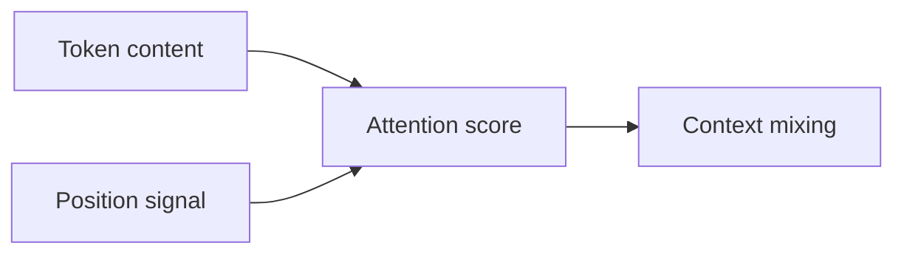

## What attention knows without position

Self-attention starts from token vectors and forms queries and keys. Without positional information, permuting the input tokens also permutes the outputs in the same way. The layer can compare content but cannot infer whether a word came first or last solely from its slot in the input tensor.

For one attention head:

$$Q=XW_Q,\quad K=XW_K,\quad A=\operatorname{softmax}\!\left(\frac{QK^\top}{\sqrt{d_k}}\right).$$

If a permutation matrix $P$ reorders tokens, then $Q'=PQ$, $K'=PK$, and the attention output is reordered by $P$. There is no fixed left-to-right relation in this expression.

## Adding position changes the comparisons

With additive position vectors, $\tilde x_i=x_i+p_i$. The score between positions $i$ and $j$ now contains content-content, content-position and position-position terms:

$$\tilde q_i^\top\tilde k_j = (x_i+p_i)^\top W_QW_K^\top(x_j+p_j).$$

The position vector works because it is consistently tied to an index during training. The network can learn weights that use those regularities when they improve the objective. The vector is not magically interpreted as “position”; the training process establishes that meaning through consistent input placement.

## A concrete thought experiment

Consider “dog bites human” and “human bites dog.” If both contain the same unordered token set, a permutation-equivariant encoder cannot distinguish the two sentence-level meanings without an order signal. Add distinct position vectors, and the model can learn different interaction patterns for subject and object locations.

## Variants and limits

Absolute learned or sinusoidal embeddings attach information to indices. Relative position biases and rotary embeddings alter pairwise attention relationships in different ways. None guarantees that every task uses position well. Test length extrapolation, spatial translation and resolution changes separately for the chosen method.

