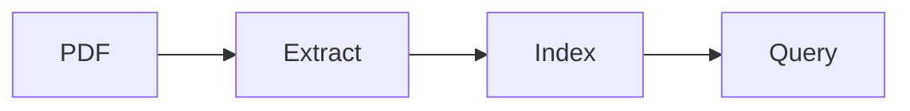

## Overview

An engineering project around turning papers into structured, searchable notes. The intended pipeline separates extraction, schema validation, vector indexing and agent analysis.

## What to add before publication

Link the exact repository, document the current implementation, include a sample query and its trace, and distinguish implemented features from planned agents. The public code link is intentionally absent until verified.
